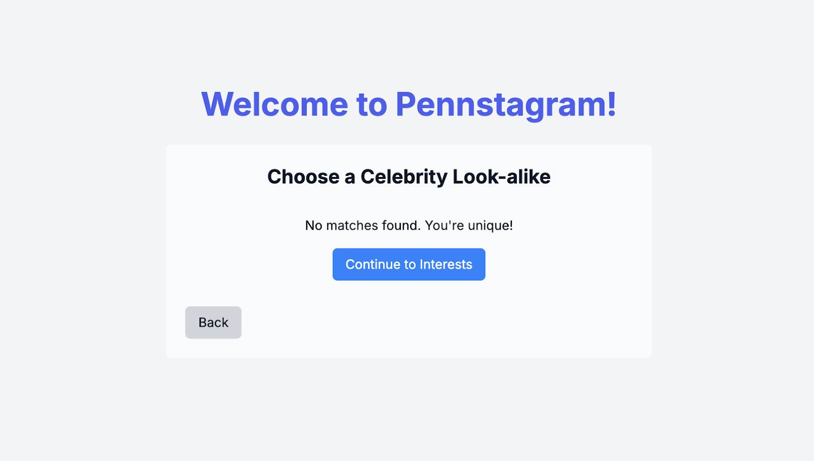
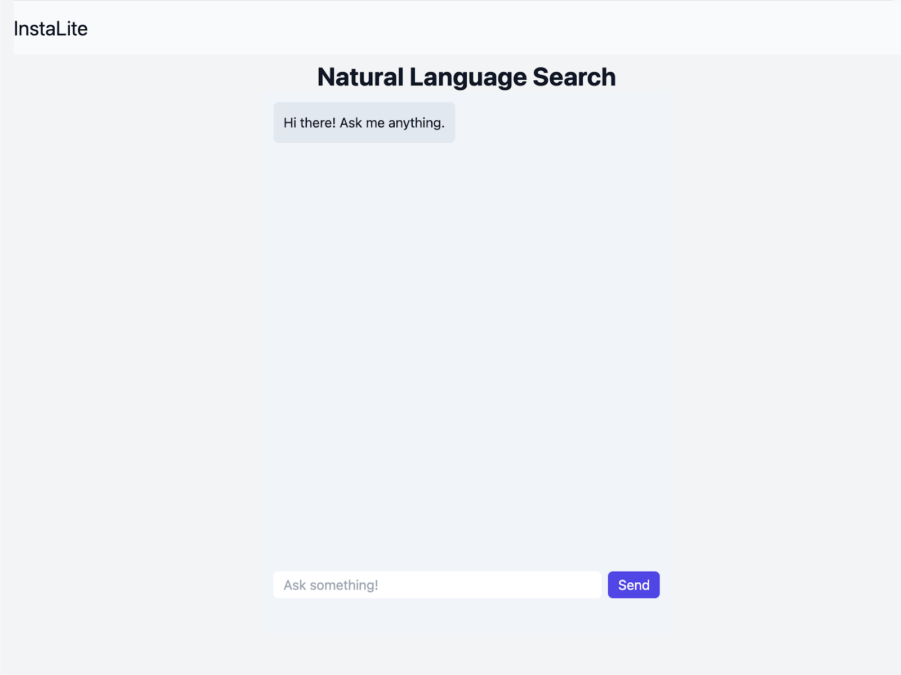

# InstaLite 

InstaLite is a social media platform developed as part of the NETS 2120 Spring 2025 final project. The platform mimics Instagram's core features, allowing users to register, interact with others, and scroll through personalized posts. It includes multiple features such as user registration, profile management, chat functionality, post ranking, and integration with Kafka for cross-team data sharing.

### Key Features

1. **User Registration & Profile Setup**:
   - Users can sign up with basic details such as name, email, and birthday.
   - Profile pictures can be uploaded, with an option for users to select a similar actor using image embeddings. This process uses **image embeddings** to match user selfies with a precomputed vector database of actor images.
   - Hashtags based on user interests are also part of the registration process.

     
   *(Placeholder for account creation screenshot)*  
     
   *(Placeholder for profile creation screenshot)*  
     
   *(Placeholder for celebrity match screenshot)*  
     
   *(Placeholder for no celebrity match screenshot)*  
     
   *(Placeholder for adding hashtags screenshot)*  

2. **Feed and Ranking System**:
   - Personalized news feed showing posts from friends, followed actors, and trending topics.
   - A **ranking algorithm** powered by **Apache Spark**, which computes personalized post recommendations based on social interactions and user interests. The ranking uses the **adsorption algorithm**, running periodically on AWS EMR to ensure users receive highly relevant posts.

     
   *(Placeholder for feed post screenshot)*  

3. **Real-Time Chat**:
   - Users can create chat groups with friends and send real-time messages using **WebSockets**.
   - Messages persist in the database, allowing users to access their chat history at any time.
   - Users can invite more friends to chat and leave rooms freely.

     
   *(Placeholder for chatroom screenshot)*  

4. **Natural Language Search (Chatbot)**:
   - A **chatbot** powered by **OpenAI API** allows users to search for posts using natural language queries, fetching results relevant to user interests and hashtags.

     
   *(Placeholder for chatbot screenshot)*  

5. **Cross-Team Data Integration (Kafka)**:
   - Posts are exchanged between different InstaLite teams via **Kafka**. We subscribe and post to the `FederatedPosts` and `BlueSky` topics for data synchronization, ensuring consistency across all participating teams.

6. **Friend Requests**:
   - Users can send friend requests, which can be accepted or rejected, allowing for the creation of a social network.

     
   *(Placeholder for add friend screenshot)*  
     
   *(Placeholder for add friend empty screenshot)*  

7. **Real-Time Online Status**:
   - Users can see if their friends are online in real time using **WebSockets**, updating their status dynamically.

     
   *(Placeholder for online status screenshot)*  

8. **Profile Page**:
   - Users can view and edit their profiles, including personal information, posts, followers, and following.

     
   *(Placeholder for profile page screenshot)*
